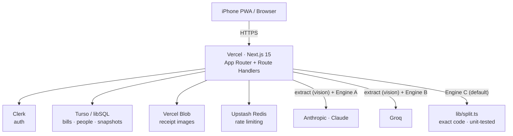

# Tally

**Split a bill from a receipt, exactly.**

Snap a receipt, assign each item to the people who shared it, and get an exact
per-person breakdown — saved with the people you split with and the picture of
the bill. Tally keeps a persistent roster, stores every bill with its receipt
image, and lets you choose, per bill, how the math gets done: **Claude** with a
proven splitting prompt, **Groq**, or **exact in-app code** (the default).

It installs to the iPhone home screen as a real PWA — no URL bar, no pinch-zoom.

---

## Why it exists

Splitting a shared bill by hand is fiddly and error-prone: who had what, how tax
and tip divide, who owes the odd cent. Doing it in a chat each time means
re-typing the same context and trusting a model to get the arithmetic right.
Tally turns it into: a receipt photo in, an exact who-owes-what out — with a
**sum-check** that proves each person's share adds back to the grand total.

---

## Tech stack

| Area | Choice |
| --- | --- |
| Framework | Next.js 15 (App Router) · React 19 · TypeScript (strict) |
| Styling | Tailwind CSS 3.4 · shadcn-style primitives · Lucide |
| Animation | Framer Motion 11 |
| Theme | next-themes (light + dark) |
| DB | Turso (libSQL / SQLite at the edge) · Drizzle ORM |
| Image storage | Vercel Blob |
| AI extraction & engines | Anthropic SDK (Claude) · Groq SDK |
| Auth | Clerk |
| Validation | Zod at every API boundary |
| Rate limiting | Upstash Ratelimit (Redis REST) |
| Hosting | Vercel |

---

## Architecture



The receipt-to-result flow is a single stepped sheet: **Upload → Extract →
Review → Assign → Compute → Result**. Extraction always uses a vision model
(code can't read an image); the split math is done by whichever engine you pick.

---

## The three split engines

All three take the **same confirmed input** (reviewed items, totals, and the
item-to-people assignment) and return the **same `SplitResult` shape**, so
history and the results screen render identically no matter which ran.

- **Exact (code) — default.** `lib/split.ts` implements the splitting rules in
  integer cents. Deterministic, instant, free, and unit-tested to ≥ 90%. It
  cannot drift.
- **Claude.** The confirmed bill is sent to the latest Sonnet with the splitting
  rules as the system prompt; Claude returns the `SplitResult` JSON.
- **Groq.** The same input to a Groq model in JSON mode. Cheapest and fastest.

**Honest behavior:** for the model engines, a model is doing the arithmetic, so
a cent can drift. Tally **re-verifies their returned numbers in code** and the
sum-check badge reflects that truth — not the model's self-graded claim. The
selector defaults to Exact.

Model ids live in env so they stay swappable when Groq rotates models:

```
ANTHROPIC_MODEL=claude-sonnet-4-6
GROQ_VISION_MODEL=qwen/qwen3.6-27b
GROQ_LOGIC_MODEL=openai/gpt-oss-120b
```

---

## The splitting algorithm (exact rules)

Worked entirely in integer cents:

1. **Per-item shares.** `baseShare = round(lineTotal / n)` for `n` sharers; the
   rounding residual goes to the **last person listed** for that item.
2. **Tax & extras pool.** `tax + service + tip + extras − discount`, split
   equally across **all** participants (including anyone with no items); the
   residual goes to the **alphabetically last** participant. A rate-based tax can
   apply the discount before tax.
3. **Per-person totals.** Item shares + tax/extras share.
4. **Reconcile.** Any difference from the receipt's grand total is applied to the
   alphabetically last participant and surfaced as a cent adjustment.

See [`lib/split.ts`](../lib/split.ts) and the table-driven tests in
[`tests/unit/split.test.ts`](../tests/unit/split.test.ts).

---

## Setup

Requires Node 20+ and pnpm.

```bash
pnpm install
cp .env.example .env.local      # fill in the values below
pnpm db:push                    # create tables (local file by default)
pnpm db:seed                    # roster + 2 sample bills so history isn't empty
pnpm dev                        # http://localhost:3000
```

> **Run the demo without Clerk.** Set `DEV_USER_ID=demo-user` in `.env.local`
> (already in the example). In development this bypasses Clerk and signs you in
> as the seeded demo user. It has **no effect in a production build**, where
> Clerk is strictly enforced.

### Environment variables

| Variable | Where to get it |
| --- | --- |
| `NEXT_PUBLIC_CLERK_PUBLISHABLE_KEY` / `CLERK_SECRET_KEY` | [Clerk dashboard](https://dashboard.clerk.com) → API Keys |
| `TURSO_DATABASE_URL` | `file:./local.db` locally; `turso db show <name> --url` for prod |
| `TURSO_AUTH_TOKEN` | `turso db tokens create <name>` (empty for local file) |
| `BLOB_READ_WRITE_TOKEN` | Vercel → Storage → Blob → read/write token |
| `ANTHROPIC_API_KEY` / `ANTHROPIC_MODEL` | [console.anthropic.com](https://console.anthropic.com) → API Keys |
| `GEMINI_API_KEY` / `GEMINI_VISION_MODEL` | [aistudio.google.com](https://aistudio.google.com) → Get API key (free; default reader for the Exact engine) |
| `GROQ_API_KEY` / `GROQ_VISION_MODEL` / `GROQ_LOGIC_MODEL` | [console.groq.com](https://console.groq.com) → API Keys |
| `UPSTASH_REDIS_REST_URL` / `UPSTASH_REDIS_REST_TOKEN` | [console.upstash.com](https://console.upstash.com) → Redis → REST API |

Local dev works with **only** the Turso file db and `DEV_USER_ID`; add the AI,
Blob, and Upstash keys to exercise extraction, real uploads, and rate limiting.

### Scripts

| Script | Does |
| --- | --- |
| `pnpm dev` | Start the dev server |
| `pnpm build` / `pnpm start` | Production build / serve |
| `pnpm test` | Unit + integration (Vitest) |
| `pnpm test:e2e` | Playwright flows |
| `pnpm lint` / `pnpm typecheck` | ESLint / `tsc --noEmit` |
| `pnpm db:push` | Push schema to the database |
| `pnpm db:generate` / `pnpm db:migrate` | Generate / apply SQL migrations |
| `pnpm db:seed` | Seed demo roster + sample bills |

---

## Security

- Clerk middleware protects `/app/*` and every `/api/*` except `/api/health`.
- Every Drizzle query is scoped by `userId`; an integration test proves user A
  cannot read user B's bills or people.
- Zod `.strict()` on every route; money is integer cents, names and quantities
  are length/range capped.
- AI keys are server-side only — all model calls go through Tally's own routes.
- Receipt uploads are restricted to `image/*` and capped at 10 MB; only the
  returned (unguessable) Blob URL is stored. To lock images down further, proxy
  them through an auth-checked route.
- A strict CSP, HSTS, `X-Content-Type-Options: nosniff`, and
  `Referrer-Policy: strict-origin-when-cross-origin` are set in
  [`next.config.ts`](../next.config.ts).

---

## Add Tally to your iPhone home screen

1. Open the deployed site in **Safari**.
2. Tap the **Share** button → **Add to Home Screen**.
3. Launch from the new icon: it opens full-screen with **no URL bar**, and
   **pinch-zoom does nothing** — it feels like a native app.

On Android Chrome an **Install** prompt appears (the app ships a service worker
and a maskable icon for the squircle mask).

> _Add screenshots of the install flow and the home-screen icon here._

---

## Deploy

1. `turso db create tally` and create an auth token.
2. In Vercel, set all env vars (Clerk, Turso, Vercel Blob, Anthropic, Groq,
   Upstash). `drizzle-kit migrate` runs as a build step on prod.
3. Push to `main`. Verify on iPhone: install is chrome-less, zoom is disabled, a
   receipt extracts, all three engines compute, and the sum-check reconciles.

---

## Testing

- **Unit (Vitest):** the exact engine is the heart of the suite — a table of
  known receipts asserting per-item residual placement, equal tax division with
  the residual on the alphabetically last participant, no-item participants,
  discount-before-tax, and final reconciliation.
- **Integration (Vitest, in-process):** route handlers against a throwaway
  libSQL file db — cross-user isolation, archive-keeps-history, and the three
  compute paths (model calls mocked).
- **E2E (Playwright):** new-bill end to end, archive-keeps-history, and the same
  bill through all three engines — against the Vercel preview or a local server.
